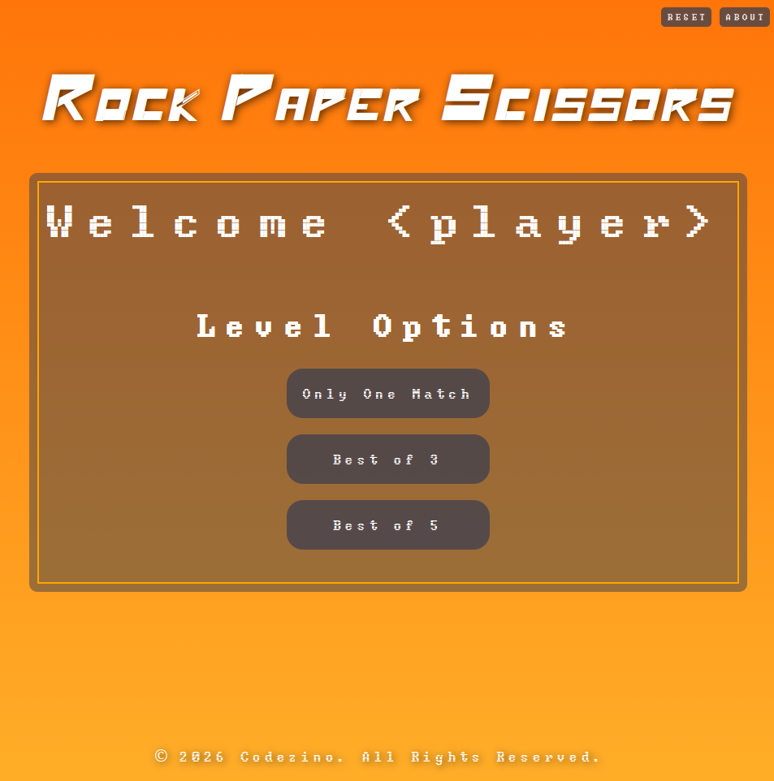
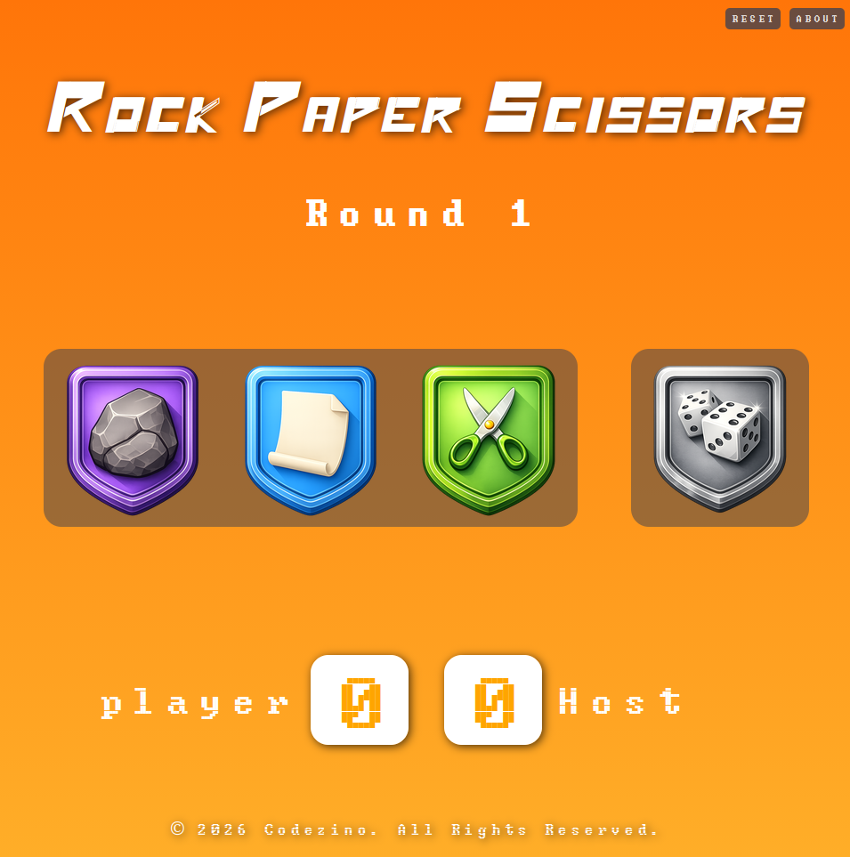
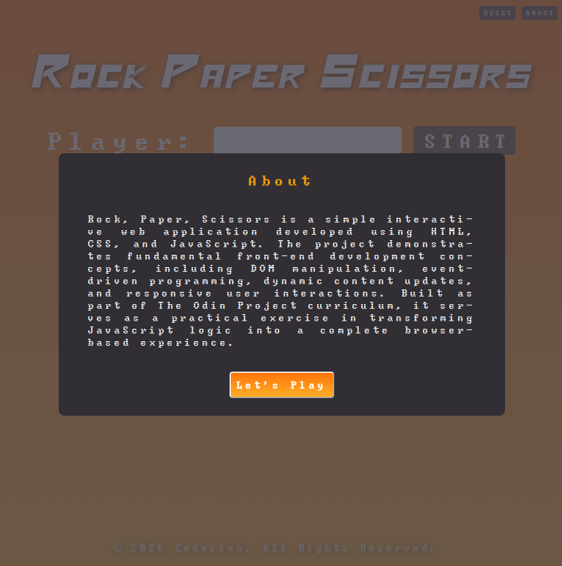

# Rock Paper Scissors

A browser-based Rock, Paper, Scissors game built with HTML, CSS, and JavaScript.

## Live Demo

🔗 [Play RPS](https://euflauzinoandre.github.io/rock_paper_sciossors/)

## Features

- Interactive gameplay
- Dynamic score tracking
- DOM manipulation with JavaScript
- Responsive user interface
- Custom styling and animations
- Random computer opponent

## Technologies Used

- HTML5
- CSS3
- JavaScript (Vanilla JS)

## What I Learned

This project helped me practice:

- DOM manipulation
- Event listeners
- Conditional logic
- Functions
- State management
- Dynamic content updates
- UI interaction using JavaScript

## Challenges

One of the biggest challenges was moving from a console-based version of the game to a fully interactive browser experience using the DOM. Managing user interactions, updating the interface dynamically, and organizing the game logic required a different way of thinking compared to simple console applications.

## Future Improvements

- Add difficulty levels
- Add sound effects
- Add game statistics
- Add animations for each move
- Implement local storage for scores

## Screenshots

## Acknowledgements

This project was created as part of The Odin Project curriculum.

https://www.theodinproject.com
